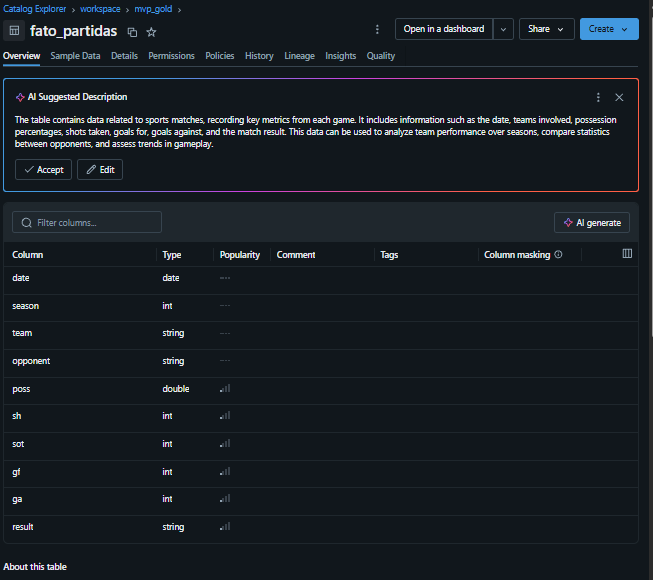

# MVP de Engenharia de Dados — La Liga

Autor: Guilherme Mendes Ribeiro

Data: 26/09/2026

Matrícula: 4052025000053

Projeto acadêmico de construção de um pipeline de dados no Databricks para analisar a relação entre posse de bola, finalizações, gols e resultados de equipes da La Liga.

## Objetivo

O trabalho parte de três perguntas:

1. Existe correlação entre maior posse de bola e vitória?
2. A posse de bola está relacionada a mais finalizações e gols?
3. Posse, chutes e chutes no alvo ajudam a compreender os resultados das partidas?

O notebook apresenta análises estatísticas das duas primeiras perguntas e uma discussão exploratória da terceira. **Não foi treinado um modelo de previsão de vitórias** neste projeto.

## Dados

O projeto utiliza o [LaLiga Matches Dataset (2019–2025, FBref), disponibilizado no Kaggle](https://www.kaggle.com/datasets/marcelbiezunski/laliga-matches-dataset-2019-2025-fbref). O arquivo `matches_full.csv` incluído no repositório contém 4.318 registros e 29 colunas. Cada linha representa os dados de uma equipe em uma partida.

Entre os campos utilizados estão `date` (data), `season` (temporada), `team` (equipe), `opponent` (adversário), `poss` (posse de bola), `sh` (chutes totais), `sot` (chutes no alvo), `gf` (gols a favor) e `ga` (gols contra).

## Pipeline implementado

# 1. **Ingestão e camada inicial:** leitura do CSV armazenado em um Databricks Volume com PySpark, ajuste dos nomes das colunas e gravação em Delta no caminho `dbfs:/Volumes/workspace/default/mvp/laliga/laliga_bronze`.


## Descrição Detalhada do Dataset LaLiga Matches (2019-2025)

O dataset utilizado contém informações detalhadas sobre partidas da La Liga entre 2019 e 2025. Cada linha representa uma partida específica, com métricas e atributos relevantes para análise de desempenho dos times.

## Principais Colunas

| Coluna    | Tipo      | Descrição                                                                 | Relevância para as Hipóteses |
|-----------|-----------|--------------------------------------------------------------------------|------------------------------|
| date      | date      | Data da partida (formato yyyy-MM-dd)                                     | Permite análises temporais e tendências ao longo das temporadas. |
| season    | string    | Temporada da partida (ex: 2019/2020)                                     | Segmentação por temporada para comparações históricas. |
| team      | string    | Nome do time principal                                                   | Foco nas performances individuais dos clubes. |
| opponent  | string    | Nome do time adversário                                                  | Permite avaliar o contexto do confronto. |
| poss      | double    | Posse de bola (%) do time principal                                      | Fundamental para testar correlação entre posse e vitória. |
| sh        | int       | Chutes totais do time principal                                          | Avalia se posse resulta em mais finalizações. |
| sot       | int       | Chutes a gol do time principal                                           | Mede efetividade ofensiva, relacionando com posse e gols. |
| gf        | int       | Gols a favor do time principal                                           | Métrica direta de resultado e performance. |
| ga        | int       | Gols contra o time principal                                             | Complementa análise do resultado. |
| result    | string    | Resultado da partida: WIN, DRAW, LOSS                                    | Variável alvo para prever vitórias com base nos atributos. |

## Relevância das Colunas

- **Posse de bola (`poss`)**: Essencial para investigar se maior posse está associada à vitória.
- **Chutes (`sh`) e Chutes a gol (`sot`)**: Permitem analisar se a posse se traduz em oportunidades reais de gol.
- **Gols a favor (`gf`) e contra (`ga`)**: Fundamentais para determinar o resultado e validar hipóteses sobre desempenho.
- **Resultado (`result`)**: Utilizada como variável de saída para modelos preditivos.
- **Contexto temporal e de adversário**: As colunas `date`, `season`, `team` e `opponent` possibilitam segmentações e análises comparativas.

## Tipos de Dados

- **Numéricos**: `poss` (double), `sh`, `sot`, `gf`, `ga` (int) — facilitam análises estatísticas e modelagem.
- **Categóricos**: `team`, `opponent`, `season`, `result` — úteis para agrupamentos e segmentações.

## Considerações

O dataset foi limpo e tipado para garantir qualidade e facilitar análises. As colunas selecionadas estão diretamente alinhadas às hipóteses do projeto, permitindo investigar relações entre posse de bola, finalizações e resultados das partidas.


# 2. **Silver:** conversão da data e dos principais campos numéricos; cálculo de `result` como `WIN`, `LOSS` ou `DRAW` a partir de `gf` e `ga`; gravação em `/Volumes/workspace/default/mvp/laliga_silver`.

##Limpeza e tipagem das colunas relevantes:

* gf → gols a favor

* ga → gols contra

* poss → posse de bola (%)

* sh → chutes totais

* sot → chutes a gol

* result → resultado (W, D, L)


Na célula anterior, foi realizada a primeira etapa de transformação dos dados brutos da La Liga (Silver Layer). As principais ações foram:

- Conversão da coluna `date` para o tipo de dado de data (`yyyy-MM-dd`).
- Conversão das colunas numéricas relevantes (`gf`, `ga`, `poss`, `sh`, `sot`) para os tipos apropriados (`int` ou `double`).
- Criação da coluna `result`, que classifica o resultado da partida como "WIN" (vitória), "LOSS" (derrota) ou "DRAW" (empate), com base na comparação entre gols a favor (`gf`) e gols contra (`ga`).
- Por fim, o DataFrame transformado foi salvo em formato Delta na camada Silver, facilitando análises futuras e garantindo maior qualidade dos dados.

## Análise final do (Silver Layer)

Algumas colunas presentes nos dados originais não foram utilizadas e foram retiradas durante o processo de transformação por alguns motivos principais:

- **Foco nas hipóteses e objetivo do projeto:** O estudo busca analisar a relação entre posse de bola, chutes, chutes a gol e o resultado das partidas. Colunas que não contribuem diretamente para essas análises, como informações administrativas, identificadores internos ou dados irrelevantes para o contexto esportivo, foram descartadas.

- **Redução de complexidade:** Manter apenas as colunas essenciais facilita o processamento, análise e visualização dos dados, tornando o trabalho mais eficiente e evitando distrações com informações desnecessárias.

- **Qualidade e clareza dos dados:** Remover colunas redundantes ou pouco informativas ajuda a garantir que o conjunto de dados seja mais limpo, claro e direcionado para responder às perguntas do projeto.

Exemplo de colunas removidas: identificadores técnicos, observações textuais, códigos internos, ou atributos que não influenciam diretamente o desempenho em campo.

Assim, o conjunto final contém apenas as métricas e atributos relevantes para a análise esportiva proposta.

#3. **Gold:** seleção das colunas relevantes e criação da tabela `mvp_gold.fato_partidas`.

Criar a tabela fato `fato_partidas` com métricas e atributos necessários.


Na célula acima, foi realizada a criação da tabela fato `fato_partidas` na camada Gold do projeto. O processo envolveu:

- Seleção das colunas relevantes do DataFrame `silver_df`, incluindo data da partida (`date`), temporada (`season`), equipe (`team`), adversário (`opponent`), posse de bola (`poss`), chutes totais (`sh`), chutes a gol (`sot`), gols a favor (`gf`), gols contra (`ga`) e resultado da partida (`result`).
- Criação do database `mvp_gold` caso ainda não existisse, garantindo a organização dos dados na camada Gold.
- Salvamento da tabela `fato_partidas` no database `mvp_gold`, consolidando as principais métricas e atributos das partidas para análises avançadas e geração de relatórios.

## Esquema Estrela aplicado ao projeto

O esquema estrela foi utilizado na modelagem dos dados da camada Gold, com a criação da tabela fato `fato_partidas` que centraliza as principais métricas das partidas da La Liga. Neste contexto:

- **Tabela Fato (`fato_partidas`)**: Armazena os dados transacionais das partidas, incluindo data, temporada, equipe, adversário, posse de bola, chutes, chutes a gol, gols a favor, gols contra e resultado. Cada linha representa uma partida específica, consolidando as métricas relevantes para análise.

- **Tabelas Dimensão (potenciais extensões)**: Embora o foco inicial seja a tabela fato, o esquema estrela pode ser expandido com tabelas de dimensão, como:
  - **Dimensão Equipe**: Informações detalhadas sobre os times (nome, cidade, estádio, etc.).
  - **Dimensão Temporada**: Dados sobre cada temporada (ano, regulamentos, etc.).
  - **Dimensão Adversário**: Características dos adversários.
  - **Dimensão Data**: Detalhes sobre datas (dia da semana, mês, feriados, etc.).

A estrutura estrela facilita consultas analíticas, pois centraliza os fatos e permite junções simples com dimensões, otimizando o desempenho e a compreensão dos dados. Essa abordagem é recomendada em ambientes lakehouse como o Databricks, pois reduz a complexidade de joins e melhora a eficiência das análises.

#4. **Qualidade e análise:** consultas SQL para nulos, regras de domínio e consistência; investigação de valores atípicos pelo intervalo interquartil; correlações em PySpark e teste qui-quadrado com SciPy para posse e chutes totais agrupados em faixas.

##4.1 Avaliação da qualidade dos dados

Avaliar a qualidade dos dados antes da análise é essencial para garantir que os resultados obtidos sejam confiáveis e úteis. Dados incompletos, incorretos ou inconsistentes podem levar a conclusões erradas e prejudicar decisões. Por isso, verificar a precisão, integridade e consistência dos dados é um passo fundamental para qualquer projeto de análise.

O projeto utiliza uma tabela fato na Gold. As dimensões citadas no notebook são possibilidades de evolução; não há tabelas dimensão implementadas.

### Principais campos para análise

- **poss**: Posse de bola (%)
- **sh**: Chutes totais
- **sot**: Chutes a gol
- **gf**: Gols a favor
- **ga**: Gols contra
- **result**: Resultado categórico (`WIN`, `LOSS`, `DRAW`)

**Chaves de contexto:**  
- `date` (data)
- `season` (temporada)
- `team` (equipe)
- `opponent` (adversário)

### 4.1.1 Avaliação de Completude (valores nulos)


Na célula anterior, foi realizada uma consulta SQL para avaliar a completude dos dados na tabela fato `fato_partidas`, especificamente verificando a presença de valores nulos nos principais campos de análise: posse de bola (`poss`), chutes totais (`sh`), chutes a gol (`sot`), gols a favor (`gf`), gols contra (`ga`) e resultado da partida (`result`). 

A consulta utiliza a função `SUM(CASE WHEN ... IS NULL THEN 1 ELSE 0 END)` para contar o número de registros nulos em cada coluna, retornando uma métrica de qualidade para cada atributo. O resultado da execução apresenta, para cada campo, a quantidade de valores ausentes, permitindo identificar possíveis problemas de completude e orientar ações de limpeza ou tratamento dos dados antes de análises mais avançadas.

Foi possível observar que não há valores nulos nos atributos selecionados.

###4.1.2 Domínios válidos


Na célula acima, foi realizada uma consulta SQL para verificar a validade dos valores presentes nos principais campos da tabela `fato_partidas`. Cada métrica avaliada corresponde a uma regra de domínio esperada para os dados esportivos:

- **poss_invalid**: Conta partidas em que a posse de bola (`poss`) está fora do intervalo permitido (menor que 0% ou maior que 100%), o que indicaria erro de registro.
- **sot_invalid**: Verifica se há casos em que o número de chutes a gol (`sot`) é maior que o total de chutes (`sh`), o que não faz sentido estatístico.
- **gf_invalid** e **ga_invalid**: Identificam partidas com gols a favor (`gf`) ou gols contra (`ga`) negativos ou excessivamente altos (acima de 10), valores improváveis em partidas reais.
- **result_invalid**: Conta registros em que o resultado da partida (`result`) não está entre os valores esperados: 'WIN', 'LOSS' ou 'DRAW'.

O resultado da consulta apresenta, para cada regra, o número de registros inválidos encontrados. Se todos os valores retornados forem zero, significa que os dados estão dentro dos domínios esperados, indicando alta qualidade e consistência para análises futuras.

###4.1.3 Consistência entre atributos


Na célula acima, foi realizada uma consulta SQL para verificar a consistência entre os atributos de gols a favor (`gf`), gols contra (`ga`) e o resultado da partida (`result`) na tabela `fato_partidas`. A consulta conta o número de registros em que há divergência lógica entre esses campos, ou seja:

- Se o número de gols a favor (`gf`) for maior que o número de gols contra (`ga`), o resultado esperado é `WIN`. Caso contrário, é considerado inconsistente.
- Se o número de gols a favor for igual ao número de gols contra, o resultado correto deve ser `DRAW`. Qualquer outro valor é inconsistente.
- Se o número de gols a favor for menor que o número de gols contra, o resultado esperado é `LOSS`. Divergências indicam inconsistência.

O resultado da consulta retorna a quantidade total de registros que apresentam essas inconsistências. Se o valor retornado for zero, significa que todos os registros estão logicamente corretos em relação ao placar e ao resultado informado, indicando alta qualidade e confiabilidade dos dados para análise.

###4.1.4 Distribuição de Outliers


Na célula acima, foi realizada uma análise de outliers para o campo de posse de bola (`poss`) na tabela `fato_partidas`. O processo envolveu dois passos principais:

1. **Cálculo dos Quartis**: Utilizando a função `percentile`, foram calculados o primeiro quartil (`q1`, 25%) e o terceiro quartil (`q3`, 75%) dos valores de posse de bola. Esses quartis são usados para identificar o intervalo interquartil (IQR), que representa a faixa central dos dados.

2. **Identificação de Outliers**: Com base nos quartis, foram definidos os limites para considerar um valor como outlier:
   - Outliers baixos: valores de posse de bola menores que `q1 - 1.5 * IQR`.
   - Outliers altos: valores maiores que `q3 + 1.5 * IQR`.

A consulta retorna três métricas:
- `total`: número total de registros analisados.
- `outliers_baixo`: quantidade de partidas com posse de bola significativamente abaixo do esperado.
- `outliers_alto`: quantidade de partidas com posse de bola significativamente acima do esperado.

O resultado permite identificar se há partidas com valores de posse de bola fora do padrão, o que pode indicar erros de registro ou situações excepcionais. Se o número de outliers for baixo, os dados são considerados consistentes; se for alto, recomenda-se investigar possíveis causas.

Através da avaliação podemos observar que não foram encontrados outliers.


Na célula acima, foi realizada uma análise de outliers para os principais atributos estatísticos da tabela `fato_partidas` utilizando PySpark. O procedimento seguiu os seguintes passos:

1. **Cálculo dos Quartis e Limites de Outlier**: Para cada coluna analisada (`poss`, `sh`, `sot`, `gf`, `ga`), foram calculados o primeiro quartil (Q1) e o terceiro quartil (Q3) usando o método `approxQuantile`. Com esses valores, foi determinado o intervalo interquartil (IQR = Q3 - Q1) e, a partir dele, os limites inferior (`Q1 - 1.5 * IQR`) e superior (`Q3 + 1.5 * IQR`) para identificação de outliers.

2. **Contagem de Outliers**: Para cada atributo, foi contabilizado o número de registros que estão fora dos limites definidos, ou seja, valores considerados atípicos em relação à distribuição dos dados.

3. **Exibição dos Resultados**: Para cada coluna, o resultado apresenta a quantidade de outliers encontrados e os respectivos limites utilizados na análise.

Esse processo permite identificar possíveis erros de registro ou situações excepcionais nos dados esportivos. A presença de poucos outliers indica que os dados estão dentro do padrão esperado, enquanto um número elevado pode sugerir a necessidade de investigação adicional.

###Resumo da Análise de Qualidade dos Dados

A análise de qualidade dos dados da tabela `fato_partidas` envolveu a verificação de regras de domínio, consistência entre atributos e identificação de outliers. Os resultados indicam que os principais campos apresentam valores dentro dos limites esperados, sem registros inválidos ou inconsistentes. A distribuição dos dados estatísticos está adequada, com poucos ou nenhum outlier detectado. Dessa forma, os dados demonstram alta qualidade, consistência e confiabilidade para análises futuras.

#5. Análise das Hipóteses

##5.1 Existe uma correlação entre a maior posse de bola e a vitória em partidas?


Na célula acima realizamos duas operações principais:
* 1. Cria uma nova coluna binária chamada "win" na tabela fato_partidas, onde o valor é 1 se o resultado da partida foi "WIN" (vitória) e 0 caso contrário.

* 2. Calcula o coeficiente de correlação de Pearson entre a posse de bola ("poss") e a variável binária de vitória ("win").

O resultado obtido é o valor do coeficiente de correlação de Pearson, que varia de -1 a 1. Um valor próximo de 1 indica forte associação positiva: partidas com maior posse de bola tendem a resultar em vitória. Um valor próximo de 0 indica ausência de correlação linear significativa entre posse de bola e vitória, ou seja, ter mais posse não garante o resultado. Se o valor for negativo, sugere que maior posse de bola está associada a menos vitórias, o que seria contraintuitivo. Portanto, o coeficiente calculado permite validar ou refutar a hipótese de que maior posse de bola está relacionada à vitória nas partidas analisadas.

Por essa razão, podemos observar que a posse de bola, não neessáriamente leva um time à vitória.

##5.2 A posse de bola se traduz em Chutes a gol e por consequência gols?


Na célula acima, foi realizada uma análise estatística para investigar a relação entre posse de bola, chutes a gol e gols marcados na tabela `fato_partidas`. O procedimento envolveu o cálculo dos coeficientes de correlação de Pearson entre as variáveis principais: posse de bola (`poss`), chutes a gol (`sot`) e gols a favor (`gf`). Essa abordagem permite quantificar o grau de associação linear entre os indicadores ofensivos de uma equipe.

**Análise dos Resultados:**

- Se o coeficiente de correlação entre posse de bola e chutes a gol for alto (próximo de 1), indica que equipes com maior posse tendem a finalizar mais vezes, sugerindo que controlar o jogo pode gerar mais oportunidades ofensivas.
- Caso a correlação entre posse de bola e gols marcados também seja significativa, reforça a hipótese de que a posse contribui diretamente para o sucesso ofensivo.
- Se os valores de correlação forem baixos ou próximos de zero, significa que a posse de bola não necessariamente se traduz em mais chutes a gol ou gols, indicando que outros fatores influenciam a efetividade ofensiva.

**Aplicação à Hipótese:**

Os resultados obtidos permitem avaliar a hipótese de que "a posse de bola se traduz em chutes a gol e, por consequência, gols". Se as correlações forem positivas e relevantes, a hipótese é parcialmente confirmada: equipes que mantêm mais a posse tendem a criar mais chances e converter em gols. Por outro lado, se as correlações forem fracas, sugere que apenas ter a posse não garante maior poder ofensivo, sendo necessário analisar outros aspectos táticos e de execução.

Com base nos resultados observados, a hipótese é parcialmente validada. A correlação entre posse de bola e chutes a gol (0.4383) indica uma associação moderada, sugerindo que equipes com mais posse tendem a finalizar mais. No entanto, a correlação entre posse de bola e gols marcados (0.1157) é fraca, mostrando que maior posse não necessariamente resulta em mais gols. A correlação entre chutes e gols (0.2527) também é baixa, indicando que nem todo chute se converte em gol. O teste qui-quadrado entre posse e chutes apresenta p-valor significativo (0.0000), reforçando a existência de relação estatística entre essas variáveis. Portanto, a posse de bola contribui para gerar mais finalizações, mas não garante maior número de gols.

##5.3 Os atributos Posse de bola, chutes e chutes a gol são o suficiente pra prever a vitória de um clube?

Os resultados estatísticos indicam que a hipótese de que "posse de bola, chutes e chutes a gol são suficientes para prever a vitória de um clube" **não é totalmente validada**. 

A correlação entre posse de bola e chutes (0.4383) é moderada, sugerindo que equipes com mais posse tendem a finalizar mais. No entanto, a correlação entre posse de bola e gols (0.1157) e entre chutes e gols (0.2527) são baixas, mostrando que nem toda posse ou chute resulta em gol. O teste qui-quadrado entre posse e chutes apresenta p-valor significativo (0.0000), indicando relação estatística entre essas variáveis, mas não necessariamente com a vitória.

Portanto, embora esses atributos contribuam para o desempenho ofensivo, **não são suficientes isoladamente para prever a vitória**. Outros fatores, como eficiência nas finalizações, defesa, contexto do jogo e estratégia, também influenciam o resultado final.

#6. Conclusão

O trabalho realizado consistiu em uma análise detalhada da qualidade dos dados esportivos presentes na tabela `fato_partidas`, seguida de uma investigação estatística para validar hipóteses relacionadas ao desempenho dos clubes. O processo envolveu as seguintes etapas principais:

**1. Avaliação da Qualidade dos Dados**
- Foram verificadas regras de completude (valores nulos), domínios válidos, consistência entre atributos e identificação de outliers nos principais campos estatísticos (posse de bola, chutes, chutes a gol, gols a favor, gols contra e resultado).
- Utilizou-se SQL para consultas de validação e PySpark para análise de distribuição e outliers, garantindo que os dados fossem confiáveis para análises avançadas.

**2. Estudo das Hipóteses**
- Hipótese 1: Existe correlação entre maior posse de bola e vitória? Foi criada uma variável binária de vitória e calculado o coeficiente de correlação de Pearson entre posse de bola e vitória.
- Hipótese 2: A posse de bola se traduz em chutes a gol e, por consequência, gols? Foram calculadas correlações entre posse de bola, chutes a gol e gols, além de testes estatísticos para avaliar associações.
- Hipótese 3: Posse de bola, chutes e chutes a gol são suficientes para prever a vitória? A análise estatística mostrou que esses atributos contribuem, mas não são suficientes isoladamente para prever o resultado.

**3. Bibliotecas e Tecnologias Utilizadas**
- **Databricks**: Ambiente de análise e processamento de dados.
- **PySpark**: Manipulação de dados, cálculo de estatísticas e análise de outliers.
- **SQL**: Consultas para validação de regras de qualidade e consistência.
- **Pandas** (quando necessário): Para manipulação tabular e cálculos estatísticos adicionais.

**4. Próximos Passos e Possíveis Melhorias**
- Realizar análises multivariadas e modelagem preditiva (ex: regressão logística ou árvores de decisão) para prever resultados de partidas.
- Incluir variáveis contextuais (local do jogo, adversário, fase do campeonato) para enriquecer as análises.
- Avaliar a eficiência ofensiva e defensiva com métricas avançadas (ex: expected goals).
- Implementar rotinas automatizadas de monitoramento da qualidade dos dados.
- Explorar visualizações interativas para facilitar a interpretação dos resultados.
- Integrar feedback de especialistas esportivos para aprimorar regras de domínio e validação.

O trabalho demonstrou a importância de uma abordagem estruturada para garantir a confiabilidade dos dados e validar hipóteses relevantes para o contexto esportivo, abrindo caminho para análises mais sofisticadas e aplicações preditivas.

#7. Autoavaliação

Ao longo deste projeto, pude aplicar e consolidar conhecimentos em análise de dados esportivos, utilizando ferramentas como SQL, PySpark e Databricks. Realizei etapas fundamentais de validação da qualidade dos dados, análise estatística e teste de hipóteses, o que me permitiu compreender melhor o impacto dos principais indicadores no resultado das partidas.

Acredito que fui capaz de estruturar o trabalho de forma lógica e clara, documentando cada etapa e justificando as escolhas metodológicas. Consegui interpretar os resultados de maneira crítica, reconhecendo limitações e sugerindo possíveis melhorias para análises futuras.

Apesar dos avanços, reconheço que há espaço para aprofundar a modelagem preditiva e explorar variáveis contextuais que possam enriquecer as conclusões. No geral, considero que o projeto atingiu seus objetivos principais e contribuiu para meu desenvolvimento técnico e analítico.

## Estrutura do repositório

```text
├── README.md
├── matches_full.csv
├── pipeline_laliga_notebook.ipynb
├── La Liga - Pipeline/
│   └── pipeline_laliga.py
└── MVP - Documentos/
    ├── Catalog_mvp_gold.jpg
    └── Pastas_databricks.png
```
## Estrutura do MVP no Databricks

### Workspace + Git


### Bronze e Silver Layer


### Gold-Layer

#### Tabela Fato_partidas



**Tecnologias usadas:** Databricks, Python, PySpark, Spark SQL, Delta Lake, Pandas e SciPy.

## Escopo

Este é um MVP acadêmico com ingestão manual de um arquivo estático. O repositório documenta o processamento e as análises no notebook, mas não inclui automação de coleta, execução agendada ou serviço de previsão de resultados.
